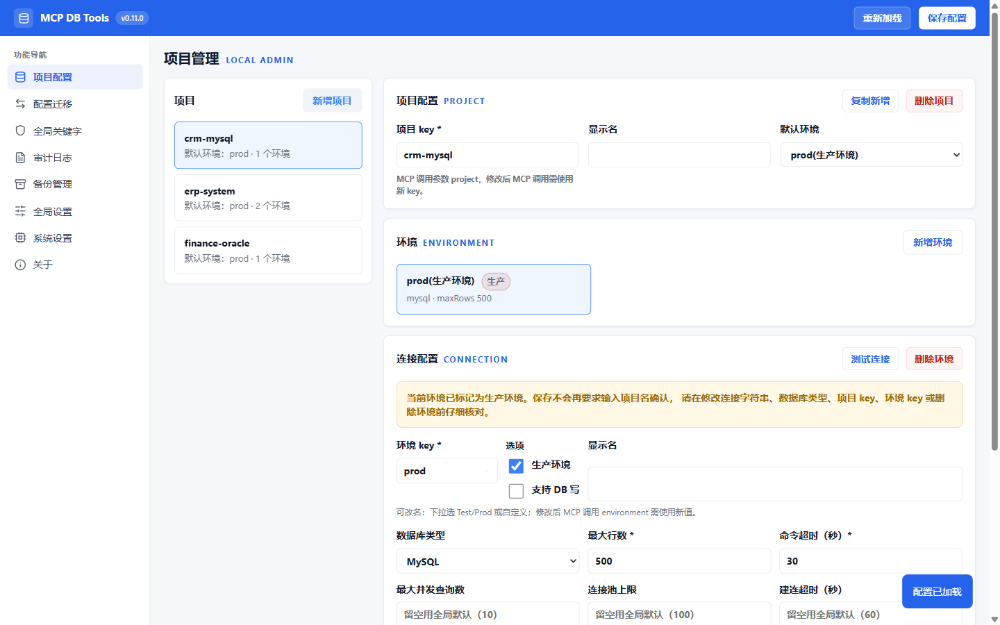

# MCP Database Tools

为支持 MCP（Model Context Protocol）的 Agent（如 [Claude Code](https://docs.anthropic.com/claude-code)、[Codex](https://developers.openai.com/codex)）提供数据库只读访问能力的工具。基于 .NET 8 + 官方 `ModelContextProtocol` SDK，支持 SQL Server、MySQL、Oracle、PostgreSQL，内置 SQL 安全守卫、多环境配置、配置热重载、每环境并发限流、审计日志，以及本机 Admin UI 配置维护页面。

## 最近更新

- **v0.11.0**：Admin 管理页全新改版——品牌顶栏 + 左侧图标导航 + 紧凑视觉；新增「关于」页，应用更新迁入并重做为一键更新（下载 → 自动安装重启），检查更新时展示 GitHub Release 更新说明；全局设置页展示配置文件路径
- **v0.10.8**：修复发布包 favicon 丢失、更新下载完成后进度条卡死

完整变更见 [Releases](../../releases)。

## 功能特性

- **四数据库支持**：SQL Server、MySQL、Oracle（兼容 11g R2+）、PostgreSQL
- **多环境配置**：同一项目可维护 `dev` / `test` / `prod` 等多环境，设置默认环境
- **SQL 安全守卫**：白名单（只读语句）+ 三层黑名单双重校验，拦截多语句注入
- **非生产环境 DB 写支持**：环境配置 `allowWrite=true` 时，允许 `INSERT` / `UPDATE` / `DELETE` / `CREATE` / `ALTER` / `DROP INDEX` / `MERGE` / `REPLACE` 等 DML/DDL 写操作并返回受影响行数 `affectedRows`；生产环境（`isProduction=true`）后端兜底强制只读，与 `allowWrite` 互斥（即便手改 `config.json` 也不生效）
- **全局关键字分只读池/写池**：阻止关键字按环境开关分别生效；Admin UI 关键字页额外展示代码内置固定关键字（只读，无法在页面修改）
- **配置热重载**：改 `config.json` 即时生效，无需重启
- **并发与连接池可控**：每个 `(project, env)` 独立并发闸门，避免高并发打满连接池
- **审计日志**：本地 SQLite 全局记录查询与阻止，支持自动/手动清理；可选记录查询结果（弹窗懒加载查看）
- **AI 友好返回**：四工具缺省返回 text 纯文本（首行状态行 + 列名行 + TSV 数据，无 JSON 外壳与转义税，省 token）；`db_query` 可传 `format="tsv"/"json"`、`db_list` 可传 `format="json"` 回退结构化 JSON
- **分页与写影响预估**：`db_query` 支持 `offset` 分页（方言自动拼接、截断时状态行标 `nextOffset` 续翻）与 `dryRun` 预估（UPDATE/DELETE 变换 COUNT 只读查询返回 `~N affected (estimated)`，不执行写）
- **元数据探索**：`db_schema` 工具两级按需加载表清单/列/索引/外键（表名参数化过滤，`sample` 可采样），替代手写四方言 `information_schema` 系 SQL
- **执行计划**：`db_explain` 工具对只读语句返回执行计划（MySQL/PG EXPLAIN、SQL Server SHOWPLAN 不实际执行、Oracle DBMS_XPLAN），慢查询分析用
- **本机 Admin UI**：浏览器维护 `config.json`，含测试连接、配置迁移、备份管理、审计查看、全局设置、系统设置与关于页一键更新
- **系统托盘应用**：WinExe 单 exe，双击运行常驻系统托盘（无控制台黑窗）；Velopack 打包，支持应用内在线更新

## 快速开始

**Windows 用户**：从 [GitHub Release](../../releases) 下载 `McpDbTools-win-Setup-<版本号>.exe` 双击安装（Velopack 安装包，无需 .NET SDK，详见[发布版本安装](#发布版本安装推荐)）。

**源码构建 / 非 Windows**：

```bash
git clone <repo>
cd mcp-db-tools
dotnet build
```

### 配置数据库

编辑 [src/McpDbTools.Server/config.json](src/McpDbTools.Server/config.json)，在 `databases` 下添加项目与环境：

```jsonc
{
  "databases": {
    "my-project": {
      "displayName": "示例项目",
      "defaultEnvironment": "test",
      "environments": {
        "test": {
          "displayName": "测试环境",
          "isProduction": false,
          "type": "sqlserver",
          "connectionString": "Server=.;Database=MyDb;Trusted_Connection=true;TrustServerCertificate=true;",
          "maxRows": 1000,
          "commandTimeout": 30,
          // 非生产环境可开启写操作（生产环境即便设 true 也会被后端兜底强制只读）
          "allowWrite": true,
          "disabledKeywords": []
        },
        "prod": {
          "displayName": "生产环境",
          "isProduction": true,
          "type": "sqlserver",
          "connectionString": "Server=prod;Database=MyDb;User Id=readonly;Password=***;TrustServerCertificate=true;",
          "maxRows": 500,
          "commandTimeout": 30,
          "disabledKeywords": []
        }
      }
    }
  }
}
```

> 程序默认读取 `%ProgramData%\McpDbTools\config.json`（Windows 跨用户共享数据目录，与程序目录分离便于升级，Velopack 每版本解压到 `%LocalAppData%` 不影响数据），可用环境变量 `ConfigStore__ConfigPath` 覆盖。**首次部署后，config.json 位于 `%ProgramData%\McpDbTools\`，不在 exe 同目录**——请通过 Admin UI 维护，或直接编辑该文件。文件不存在时空配置启动，可后续通过 Admin UI 补齐。开发时若用源码目录下的 config.json，需显式设置该环境变量。

### 接入 MCP 客户端

本工具通过 MCP Streamable HTTP 与 Agent 通信。服务须先启动（开发时 `dotnet run --project src/McpDbTools.Server`；安装版双击 `McpDbTools-win-Setup-<版本号>.exe` 后运行托盘应用，可在系统设置页开启开机自启），再让 MCP 客户端连接 `http://127.0.0.1:<port>/mcp`。下面给出 Claude Code 与 Codex 的配置示例，其它 MCP 客户端按各自文档以 HTTP URL 接入即可。

> 建议先用 Admin UI 测试连接、确认配置无误，再接入客户端：`dotnet run --project src/McpDbTools.Server`，浏览器打开 `http://127.0.0.1:61123/admin`（默认端口 61123，可由 config.json `port` 字段或 `--admin-port` 覆盖）。

#### Claude Code

Claude Code 在 `mcp.json`（项目级 `.mcp.json` 或用户级配置）中用 JSON 配置 `mcpServers`。HTTP 模式下只需指定 URL（服务启动方式见上文）：

```json
{
  "mcpServers": {
    "db-tools": {
      "type": "http",
      "url": "http://127.0.0.1:61123/mcp"
    }
  }
}
```

也可用 Claude Code CLI 一条命令添加（等效于上面配置；CLI 默认 scope 是 `local`，如要写用户级配置请加 `-s user`，要写项目级共享 `.mcp.json` 请加 `-s project`）：

```bash
claude mcp add --transport http db-tools http://127.0.0.1:61123/mcp
```

#### Codex

[Codex](https://developers.openai.com/codex) 在 `~/.codex/config.toml`（或项目级 `.codex/config.toml`）中用 TOML 配置，每个 server 一个 `[mcp_servers.<name>]` 表。Codex 通过是否存在 `url` 字段区分 stdio 与 streamable HTTP（无显式 `type` 字段），HTTP 模式只需写 `url`：

```toml
[mcp_servers.db-tools]
url = "http://127.0.0.1:61123/mcp"
```

> Codex 默认工具执行超时 `tool_timeout_sec = 60` 秒。如果数据库查询可能较慢，可在 `[mcp_servers.db-tools]` 下追加 `tool_timeout_sec = 120` 调大。

#### 验证接入

重启客户端后，在对话中让 Agent：

1. 先调用 `db_list`（不传参数）查看可用项目；
2. 再用 `db_list(project="xxx")` 查看该项目环境；
3. 探索表结构用 `db_schema`（不传 table 得表清单，传 table 得列/索引/外键）；
4. 最后调用 `db_query` 执行只读查询；慢查询分析用 `db_explain`。

## 运行模式

默认即系统托盘应用（WinExe，无控制台黑窗）：单进程同时承载系统托盘 UI、Admin UI（`/admin`）与 MCP Streamable HTTP（`/mcp`），仅监听 `127.0.0.1`。主线程跑 WinForms 消息循环（托盘 UI），Web 宿主在后台 Task 运行：

| 参数            | 说明                                                       |
| --------------- | ---------------------------------------------------------- |
| 无参数          | 默认。启动托盘应用，同端口出 `/admin` + `/mcp`             |
| `--admin-port`  | 覆盖默认端口（取值 1-65535）                              |

端口优先级：命令行 `--admin-port` > config.json 的 `port` 字段 > 默认 `61123`。旧的 `--admin-only` / `--admin` 参数已移除，只监听 `127.0.0.1`。首次访问 `/admin` 自动设置仅限该路径的 HttpOnly、SameSite=Strict 本机会话 cookie，secret 只存于进程内存。

托盘应用常驻后台（可在系统设置页开启开机自启，见 [发布与部署](#发布与部署)）；不常驻则 MCP 客户端无法连接。托盘应用无控制台，诊断日志写入 `%ProgramData%\McpDbTools\logs\app-yyyyMMdd.txt`。

> **安全提示（本机信任模型）：** HTTP 合一后 `/admin` 与 `/mcp` 同进程同端口，均仅监听 `127.0.0.1`，且 `/mcp` 与 `/admin/api/*` **均不鉴权**——`/admin` 的会话 cookie 仅限浏览器 `/admin` 路径，不保护 API 调用。任何能访问 `127.0.0.1:<port>` 的本机进程或 Agent 都可调用 `/admin/api/*` 修改配置，或经 `/mcp` 查询数据库。远程访问、TLS、端点鉴权留作后续独立设计（本次不做）；多用户主机或不受信任环境暂不适用。

```bash
# 开发时（控制台直接跑，便于看实时日志）
dotnet run --project src/McpDbTools.Server
ConfigStore__ConfigPath=D:/GitHub/MCP-DB-Tools/src/McpDbTools.Server/config.json \
  dotnet run --project src/McpDbTools.Server -- --admin-port 61123
```

## Admin UI

浏览器打开启动日志中的地址（默认 `http://127.0.0.1:61123/admin`）即可维护配置：



功能分八个页面：

- **项目配置**（`#/projects`）：增删项目和环境，**key 创建后不可修改**；维护连接字符串、数据库类型、`maxRows`、`commandTimeout`、环境级并发/连接池参数与阻止关键字；内置测试连接（不落盘）。
- **配置迁移**（`#/transfer`）：勾选项目导出配置 JSON，粘贴导入并预览四类变更（新增/更新/删除/跳过）与校验问题。
- **全局关键字**（`#/keywords`）：维护只读池 / 写池全局默认与按类型追加的阻止关键字；展示代码内置固定关键字（只读，无法在页面修改）。
- **审计日志**（`#/audit-log`）：按项目/环境/类型/状态/时间/SQL 关键词筛选，分页查看，长文本点击弹窗复制。纯只读。
- **备份管理**（`#/backups`）：列出、下载、恢复（恢复前自动快照可撤销）、删除配置备份。
- **全局设置**（`#/settings`）：展示配置文件路径；审计日志与备份文件的自动清理开关和保留天数；手动清理两者（按 10/20/30/50 天）。
- **系统设置**（`#/system`）：查看/修改 Web 端口（改后自动重启生效）、开机自启开关、一键注册 MCP 到 Claude Code、重启服务。
- **关于**（`#/about`）：当前版本、检查更新（展示最新版本与更新说明）、一键更新（下载 → 自动安装并重启，Velopack 增量更新）。

写入安全：保存前自动备份当前 `config.json`，经临时文件校验后原子替换，避免 MCP 进程读到半写入文件。生产环境显示风险提示。保存会重写为标准 JSON，原注释与手工排版不保留。

## MCP 工具

### db_list

列出数据库项目与环境，**按需加载**避免环境多时返回数据量过大。建议查询前先调用。

| 参数          | 类型   | 必填 | 说明                                                                       |
| ------------- | ------ | ---- | -------------------------------------------------------------------------- |
| `project`     | string | 否   | 项目名。不传返回项目索引（轻量）；传则返回该项目环境详情                    |
| `environment` | string | 否   | 环境名，配合 `project` 缩小到单环境。单独传无意义                          |
| `format`      | string | 否   | 返回格式：缺省 `text` 纯文本；传 `"json"` 回退 JSON 结构（行为同下表矩阵） |

空白字符串等同未传。行为矩阵：

| project    | environment | 返回 |
|------------|-------------|------|
| 不传       | —           | 项目索引：每项目一行 `name (default env)`，不含环境 |
| 传（存在） | 不传        | 该项目全环境详情 |
| 传（存在） | 传（存在）  | 该单环境详情 |
| 传（存在） | 传（不存在）| `FAIL ENVIRONMENT_NOT_FOUND` + 可用环境列表（json 档附该项目全环境 `environments`） |
| 传（不存在）| 任意        | `FAIL PROJECT_NOT_FOUND` + 可用项目列表（json 档附 `availableProjects`） |

环境详情每环境一行（tab 分列）：`name  type  databaseName  prod=y|n  write=y|n  maxRows=N`，六个决策字段便于 Agent 按库类型组织 SQL、在生产环境谨慎操作。传错时错误文案直接附可用项目或环境列表，可据此重试。

不传 project（首次发现项目，缺省 text）：

```
my-project (default test)
crm (default prod)
```

### db_query

在指定项目和环境上执行 SQL 查询。只读环境仅允许 `SELECT` 等只读语句；写环境（`allowWrite=true` 且 `isProduction=false`）支持 `INSERT` / `UPDATE` / `DELETE` / `CREATE` / `ALTER` / `DROP INDEX` / `MERGE` / `REPLACE` 等 DML/DDL 写操作，返回受影响行数 `affectedRows`。生产环境后端兜底强制只读。

| 参数          | 类型   | 必填 | 说明                                                                           |
| ------------- | ------ | ---- | ------------------------------------------------------------------------------ |
| `project`     | string | 是   | 项目名，对应 `config.json` 中 `databases` 的键                                 |
| `sql`         | string | 是   | SQL 语句；只读环境仅允许只读操作，写环境另支持 DML/DDL 写操作                  |
| `environment` | string | 否   | 环境名；未传时使用项目的 `defaultEnvironment`                                  |
| `limit`       | int    | 否   | 临时限制返回行数，必须为正整数；最终取 `min(limit, maxRows)`，不能突破配置上限 |
| `format`      | string | 否   | 返回格式三档：缺省 `text` 纯文本（见下方示例）；`"tsv"` JSON 壳 + `rowset`；`"json"` JSON 壳 + `rows` 二维数组 |
| `offset`      | int    | 否   | 跳过前 N 行再返回（仅读语句）；方言拼接由工具完成。SQL Server/Oracle 要求 SQL 带 `ORDER BY`；SQL 自带 `LIMIT`/`OFFSET`/`FOR UPDATE` 或多语句时不可用；截断时状态行标 `[truncated, nextOffset=N]` 供续翻 |
| `dryRun`      | bool   | 否   | 写影响行数预估：标准形态 `UPDATE`/`DELETE` 变换为 `COUNT` 只读查询返回 `OK ~N affected (estimated)` 状态行，不执行写；INSERT/DDL/别名/多表/TOP/CTE 等返回 `DRYRUN_UNSUPPORTED`；不可与 `limit`/`offset` 同用 |

缺省返回 text 纯文本（首行状态行 + 列名行 + TSV 数据，制表符分列、换行分行、`\N` 表示 NULL、二进制列显示 `<binary NB>`）：

```
OK 2 rows @my-project/test (sqlserver)
Id	Name	CreatedAt
1	张三	2024-01-15
2	李四	2024-03-22
```

状态行标注规则：`offset` 分页时类型后附 `, offset=N`；截断时行尾附 `[truncated, nextOffset=M]`（未截断无标记）；dryRun 单行 `OK ~N affected (estimated) @...`；写成功单行 `OK N affected @...`；失败单行 `FAIL 错误码 @项目/环境: 错误消息`（不带执行耗时）。

`format="tsv"` 返回 JSON 壳（`columns` + `rowset`，字段含 `rowCount`/`truncated`），`format="json"` 时 `rowset` 替换为 `rows` 二维数组——两档为结构化回退，适合程序化消费。

错误以结构化 JSON 返回，不抛到协议层。常见错误码：

| 错误码                  | 说明                                 |
| ----------------------- | ------------------------------------ |
| `PROJECT_NOT_FOUND`     | 项目不存在                           |
| `ENVIRONMENT_REQUIRED`  | 未指定环境且无默认环境               |
| `ENVIRONMENT_NOT_FOUND` | 环境不存在                           |
| `SQL_BLOCKED`           | SQL 被安全守卫阻止                   |
| `SQL_PARSE_ERROR`       | SQL 为空或无法识别首关键字           |
| `RATE_LIMITED`          | 并发达上限，排队等待超时             |
| `QUERY_CONNECT_TIMEOUT` | 建立连接超时（连接池耗尽或网络不可达）|
| `QUERY_TIMEOUT`         | 查询执行超时（超过 `commandTimeout`）|
| `QUERY_ERROR`           | 数据库执行错误                       |
| `PARAMETER_ERROR`       | 参数冲突：offset 用于写语句、dryRun 用于读语句、dryRun 组合 limit/offset、多语句或自带分页/锁子句等 |
| `OFFSET_REQUIRES_ORDER_BY` | SQL Server/Oracle 分页且 SQL 无 ORDER BY |
| `DRYRUN_UNSUPPORTED`    | INSERT/DDL/表别名/SET 含子查询/多表/TOP/CTE 等形态不支持影响行数预估 |

### db_schema

列出数据库元数据，两级按需加载（与 `db_list` 哲学一致）：不传 `table` 返回表清单（schema、表名、注释、估算行数）；传 `table` 返回该表列/索引/外键三段。替代手写四方言 `information_schema` / `sys.*` / `all_*` 元数据 SQL。

| 参数          | 类型   | 必填 | 说明                                                       |
| ------------- | ------ | ---- | ---------------------------------------------------------- |
| `project`     | string | 是   | 项目名                                                     |
| `environment` | string | 否   | 环境名；未传时使用项目的 `defaultEnvironment`              |
| `table`       | string | 否   | 表名（可带 `schema.table` 前缀）；仅允许常规标识符字符     |
| `sample`      | int    | 否   | >0 时附 `SELECT *` 采样前 N 行（需配合 `table`，取 `min(sample, maxRows)`） |

返回 text 纯文本：首行状态行 `OK tables @项目/环境 (类型)`（表模式为 `table=名`），其后每段以 `# 段名 (行数)` 起始 + 列名行 + TSV 数据（段体与 `db_query` 同一编码）：表清单模式单段 `tables`；单表模式三段 `columns` / `indexes` / `foreignKeys`，sample 时追加 `sample` 段。说明：Oracle 对象名以大写存储（模板内部按 `UPPER` 匹配），且 `all_*` 视图仅返回当前用户有权限可见的对象；各库行数为统计信息估算值，非精确计数。

### db_explain

返回 SQL 执行计划，慢查询分析用。仅分析**只读语句**——写语句即使在写环境（`allowWrite=true`）也返回 `SQL_BLOCKED`（写环境下 SqlGuard 会对写语句放行，工具显式按语句类型拒绝）。

| 参数          | 类型   | 必填 | 说明                                          |
| ------------- | ------ | ---- | --------------------------------------------- |
| `project`     | string | 是   | 项目名                                        |
| `sql`         | string | 是   | 只读 SQL 语句                                 |
| `environment` | string | 否   | 环境名；未传时使用项目的 `defaultEnvironment` |

返回计划行集（text 纯文本：状态行 + 列名行 + TSV，与 `db_query` 读形状同构），按方言输出：MySQL 为传统 `EXPLAIN` 列（id/select_type/table/type/key/rows/Extra）；PostgreSQL 为默认文本格式计划；SQL Server 为 `SHOWPLAN_ALL` 计划列（StmtText/PhysicalOp/EstimateRows/TotalSubtreeCost 等，**不实际执行**）；Oracle 经 `DBMS_XPLAN` 输出（依赖 PLAN_TABLE，精简权限账号缺失时报 `QUERY_ERROR` 并提示）。不支持 `EXPLAIN ANALYZE`（会实际执行语句）。

## 配置文件详解

完整配置见 [src/McpDbTools.Server/config.json](src/McpDbTools.Server/config.json)。核心结构：

```jsonc
{
  "defaultDisabledKeywords": ["DROP", "DELETE", "UPDATE"],
  // 写池：allowWrite=true 环境的全局阻止关键字，空时回退代码内置 BuiltInWrite
  "defaultWriteDisabledKeywords": ["DROP TABLE", "TRUNCATE"],
  "defaultDisabledKeywordsByType": {
    "sqlserver": ["BULK INSERT", "xp_cmdshell"],
    "mysql": ["LOAD DATA", "FLUSH"],
    "oracle": ["FLASHBACK", "PURGE"],
    "postgresql": ["COPY", "VACUUM", "ANALYZE"]
  },
  // 并发与连接池全局默认（缺省时用内置默认 10/5/100/60）
  "defaultMaxConcurrency": 10,
  "defaultMaxConcurrencyWaitSeconds": 5,
  "defaultMaxPoolSize": 100,
  "defaultConnectTimeoutSeconds": 60,
  // 运维清理（缺省时全部关闭，由 Admin UI「全局设置」维护）
  "maintenance": {
    "auditLogAutoCleanup": false,
    "auditLogRetentionDays": 30,
    "backupAutoCleanup": false,
    "backupRetentionDays": 30
  },
  "databases": {
    "<项目>": {
      "displayName": "项目显示名",
      "defaultEnvironment": "test",
      "environments": {
        "<环境>": {
          "displayName": "环境显示名",
          "isProduction": false,
          "type": "sqlserver|mysql|oracle|postgresql",
          "connectionString": "...",
          "maxRows": 1000,
          "commandTimeout": 600,
          "maxConcurrency": 10,           // 可选，覆盖全局（<=0 回退全局）
          "maxPoolSize": 100,
          "connectTimeoutSeconds": 60,
          "disabledKeywords": []
        }
      }
    }
  }
}
```

> 残留的旧 `audit` 节点会被静默忽略；`maintenance` 缺省时全部关闭，向后兼容。

### 三层 SQL 阻止关键字

| 层级 | 字段                                                    | 作用域                         |
| ---- | ------------------------------------------------------- | ------------------------------ |
| 全局 | `defaultDisabledKeywords`                               | 所有数据库、所有项目、所有环境 |
| 类型 | `defaultDisabledKeywordsByType`                         | 按数据库类型追加               |
| 环境 | `databases.<项目>.environments.<环境>.disabledKeywords` | 单个环境追加                   |

最终阻止列表 = 全局 ∪ 按类型 ∪ 环境。全部转大写去重；下层只能追加，不能缩减上层。

> **只读池 / 写池**：`defaultDisabledKeywords` 是只读环境（`allowWrite` 缺省或 `false`）的全局阻止关键字，覆盖 `DROP` / `DELETE` / `UPDATE` / `INSERT` 等所有写动词；`defaultWriteDisabledKeywords` 是写环境（`allowWrite=true` 且非生产）的全局阻止关键字，默认放开业务写（`INSERT` / `UPDATE` / `DELETE` / `CREATE` / `ALTER` / `DROP INDEX` / `MERGE` / `REPLACE`），保留结构删除、系统级、账号权限、动态 SQL 等高危项。同一环境按 `allowWrite` 开关二选一，由后端解析时按"`isProduction=true` 强制只读，否则看环境 `allowWrite`"自动选池；`defaultDisabledKeywordsByType` 与环境级 `disabledKeywords` 在两种环境下都按上述三层规则追加。

### 并发与连接池

为避免高并发下 `db_query` 因连接池耗尽或线程池饥饿而卡死：

| 配置项 | 全局默认 key | 环境级覆盖 | 内置默认 |
| ------ | ------------ | ---------- | -------- |
| 每环境最大并发查询数 | `defaultMaxConcurrency` | `maxConcurrency` | 10 |
| 超载排队最长等待秒数 | `defaultMaxConcurrencyWaitSeconds` | —（仅全局） | 5 |
| 连接池上限 | `defaultMaxPoolSize` | `maxPoolSize` | 100 |
| 建立连接超时秒数 | `defaultConnectTimeoutSeconds` | `connectTimeoutSeconds` | 60 |

- 每个 `(project, environment)` 独立并发闸门，慢库不拖累其它环境；超限排队，等待超时返回 `RATE_LIMITED`。
- 连接池上限与建连超时按数据库类型拼接到连接串（如 SQL Server 的 `Max Pool Size` / `Connect Timeout`），并作为建连兜底超时。
- 环境级 `<=0` 或留空回退全局；全局未配置用内置默认。旧 config.json 不写这些字段时行为不变，且支持热重载。

### 审计日志

审计日志**全局开启**，记录到 `%ProgramData%\McpDbTools\audit.db`（SQLite，WAL 模式，与 config.json 同目录），MCP 写入与 Admin 读取可同进程并发。

- 每次成功解析到项目与环境的 `db_query` 都会记录一条（含被阻止与执行失败）；早期参数解析错误（项目/环境不存在）不入库。
- 写入经 Channel 入队、单消费者串行落盘，避免高并发下线程池饥饿与写锁竞争。
- 清理策略由「全局设置」的 `maintenance` 节点控制：默认不清理，可开启按保留天数的自动清理（后台服务每小时检查，随 Web 进程常驻运行），也可手动按 10/20/30/50 天清理。
- 「全局设置」的「记录查询结果」开关（`maintenance.auditRecordResults`，默认关闭）开启后，成功的 `db_query` 会把完整查询结果（columns + rows）以 JSON 存入 `audit_log_result` 子表（1:1 关联主表）。结果集不限制大小，关闭开关或失败查询不入子表。审计日志列表不展示结果，点击 SQL 单元格弹窗时按需懒加载渲染为表格（含行号、NULL 灰字、滚动）。开关关闭前的老记录无结果数据，弹窗提示「该记录无查询结果」。开启后请关注 `audit.db` 体积，配合自动/手动清理使用。

## SQL 安全策略

**白名单（按数据库类型）**：

- 通用：`SELECT`、`WITH`（CTE）、`EXEC` / `EXECUTE`
- MySQL 额外：`CALL`、`SHOW`、`DESCRIBE` / `DESC`、`EXPLAIN`
- Oracle 额外：`CALL`、`DESCRIBE` / `DESC`
- SQL Server 额外：`sp_help`、`sp_tables`、`sp_columns` 等系统存储过程
- PostgreSQL 额外：`CALL`、`EXPLAIN`、`SHOW`、`TABLE`、`VALUES`（不含 `EXECUTE`：PG 中为执行 prepared statement，动态 SQL 语义，风险高）

**黑名单**：`DROP`、`DELETE`、`UPDATE`、`INSERT`、`ALTER`、`CREATE`、`TRUNCATE`、`MERGE`、`GRANT`、`REVOKE` 等，外加按类型和环境追加的关键字。

**写环境追加白名单**（`allowWrite=true` 且 `isProduction=false`）：在只读白名单基础上追加 `INSERT`、`UPDATE`、`DELETE`、`MERGE`、`REPLACE`、`CREATE`、`ALTER`、`DROP INDEX` 等写动词首关键字。这些动词在只读环境会被首关键字白名单拒绝；在写环境放行，但仍受写池黑名单（结构删除、系统级、动态 SQL 等）与多语句注入扫描约束。生产环境（`isProduction=true`）后端兜底强制只读，即使手改 `config.json` 设置 `allowWrite=true` 也不生效。

校验：去注释 → 规范化空白 → 首关键字白名单 → 全文黑名单扫描，可拦截 `SELECT 1; DROP TABLE x` 这类多语句注入。

## 发布与部署

### 目录结构

Velopack 安装版：程序与用户数据物理分离，应用更新（增量 delta）只切换程序，用户数据不丢失：

```text
%LocalAppData%\McpDbTools\                # Velopack 安装目录（每版本解压到此，更新自动切换）
├── current\McpDbTools.Server.exe
├── current\wwwroot\admin\                # SPA 静态资源
└── ...

%ProgramData%\McpDbTools\                  # 用户数据目录（跨版本、跨用户共享，更新不丢）
├── config.json                           # 配置
├── audit.db                              # 审计日志（首次写入自动创建）
├── logs\app-yyyyMMdd.txt                 # 托盘应用文件日志
└── backups\                              # 配置备份（保存自动生成）
```

数据目录选用 `%ProgramData%\McpDbTools`（Windows 跨用户共享数据目录），与 Velopack 安装目录（`%LocalAppData%`）分离，确保应用增量更新不丢配置与审计数据。

> 数据目录由 `DataDirectoryResolver` 集中解析，优先级：调用方传入 > 环境变量 `ConfigStore__ConfigPath` > `%ProgramData%\McpDbTools` > exe 同目录。多数情况下无需关心，默认值即可。

### 发布版本安装（推荐）

从 [GitHub Release](../../releases) 下载 `McpDbTools-win-Setup-<版本号>.exe` 双击安装（Velopack 安装包，self-contained win-x64，免装 .NET 运行时）：

- 安装后自动建开始菜单 / 桌面快捷方式，运行后常驻系统托盘
- 在 Admin UI「系统设置」页开启**开机自启**、**一键注册 MCP** 到 Claude Code
- **应用更新**：在「关于」页检查更新并一键安装（Velopack 增量 delta，更新源默认 GitHub Releases，展示更新说明）

便携使用可下载 `McpDbTools-win-Portable-<版本号>.zip`，解压后直接运行 `McpDbTools.Server.exe`。

> 当前仅发布 Windows x64。macOS / Linux 请走下方「手动发布」自行构建（注意 Velopack 仅 Windows，需自行配置常驻进程）。

### 从源码打包发布

仓库根目录的 [`release.ps1`](release.ps1) 完成"`dotnet publish`（self-contained win-x64）→ `vpk pack` 生成 Velopack 安装包"：

```powershell
.\release.ps1
```

依赖 `dotnet` SDK 与 [vpk](https://github.com/velopack/velopack) 全局工具（`dotnet tool install -g vpk`）。版本号取最近 git tag（去前缀 `v`），产物输出到 `Releases\`：`McpDbTools-win-Setup-<版本号>.exe`（安装器）、`McpDbTools-win-Portable-<版本号>.zip`（便携包）、`McpDbTools-*-full.nupkg` + 增量 delta、`releases.win.json`（更新元数据）。

发到 GitHub Releases 供应用内检查更新（需 Personal Access Token）：

```powershell
vpk upload github -o Releases --repoUrl https://github.com/lzm04521/MCP-DB-Tools --token <TOKEN> --publish
```

CI 自动发布：打 `v*` tag 触发 [`.github/workflows/release.yml`](.github/workflows/release.yml)，自动执行 `release.ps1` + 创建 Release + 上传 assets（含 `releases.win.json`）。

### 手动发布

如不走部署脚本（例如远程机器、便携部署、或非 Windows 平台）：

```bash
# Windows
dotnet publish src/McpDbTools.Server -c Release

# 指定目标架构（self-contained 单文件，免装运行时）
dotnet publish src/McpDbTools.Server -c Release -r win-x64 --self-contained true -p:PublishSingleFile=true
dotnet publish src/McpDbTools.Server -c Release -r win-arm64 --self-contained true -p:PublishSingleFile=true

# 非 Windows（macOS / Linux）—— 官方不发布这些平台的包，需自行构建
dotnet publish src/McpDbTools.Server -c Release -r osx-arm64 --self-contained true -p:PublishSingleFile=true
dotnet publish src/McpDbTools.Server -c Release -r linux-x64 --self-contained true -p:PublishSingleFile=true
```

发布产物拷到目标目录后，首次运行会自动在 `%ProgramData%\McpDbTools` 创建数据目录与空配置。也可用环境变量 `ConfigStore__ConfigPath` 指定自定义路径。

> 非 Windows 平台构建产物后需自行配置常驻进程（systemd 单元、launchd 等）与 MCP 客户端连接 `http://127.0.0.1:<port>/mcp`；系统托盘 UI（WinForms）与 Velopack 在线更新仅 Windows 可用。

### 常驻与开机自启

托盘应用（Windows）常驻后台，开机自启由 Admin UI「系统设置」页控制（注册表 `HKCU\Software\Microsoft\Windows\CurrentVersion\Run`，当前用户级，无需管理员），无需 NSSM 服务或登录计划任务：

```bash
# 前台运行（调试）
McpDbTools.Server.exe --admin-port 61123
```

服务启动后同时暴露 Admin UI（`/admin`）与 MCP HTTP（`/mcp`）；MCP 客户端只需配置 URL，不感知承载方式。

## 开发

```bash
dotnet build
dotnet test                                    # 全部测试
dotnet test --filter "FullyQualifiedName~SqlGuardTests"   # 单个测试类
dotnet run --project src/McpDbTools.Server                                  # 启动托盘应用（/admin + /mcp）
dotnet run --project src/McpDbTools.Server -- --admin-port 61123            # 指定端口（默认 61123）
dotnet publish src/McpDbTools.Server -c Release
```

> MCP 改用 HTTP 后 stdout 不再是协议通道。托盘应用（WinExe）无控制台，日志走文件（数据目录 `logs/app-yyyyMMdd.txt`）；开发时 `dotnet run` 仍走控制台 + ASP.NET Core logging 管道。

### 项目结构

```text
src/McpDbTools.Server/
├── Admin/             # Admin API、配置读写、测试连接、备份管理、全局设置
├── Audit/             # 审计日志（SQLite + Channel 异步串行写入）
├── Configuration/     # 配置模型、热重载、三层关键字合并、连接串拼接、DataDirectoryResolver 数据目录解析
├── Database/          # 四种数据库 provider + 工厂 + 每环境并发限流器
├── Maintenance/       # 运维清理后台服务（审计日志/备份自动清理）
├── Hosting/           # TrayHost 托盘宿主、RunningState、RestartHelper（改端口延迟重启）
├── Logging/           # FileLoggerProvider（托盘无控制台时文件日志）
├── Security/          # SqlGuard SQL 安全守卫
├── Tools/             # db_list / db_query / db_schema / db_explain 四个 MCP 工具
├── wwwroot/admin/     # 静态 Admin UI（无 npm 构建链 SPA）
└── Program.cs         # 运行模式入口
```

### 技术栈

.NET 8（net8.0-windows + WinForms 托盘）、ASP.NET Core Minimal API、原生 HTML/CSS/JS、[ModelContextProtocol](https://github.com/modelcontextprotocol/csharp-sdk) 1.4.0、[Velopack](https://github.com/velopack/velopack)（Windows 安装包 + 应用内在线更新）、SqlClient / MySqlConnector / Oracle.ManagedDataAccess.Core / Npgsql、Microsoft.Data.Sqlite、xUnit。

## 已知限制

- 不解析字符串字面量，字符串内的关键字可能被误判（安全工具宁可误拒）
- 不支持存储过程参数化传入，不支持跨环境/多连接 JOIN（同一连接内跨 schema 由数据库决定）
- Admin UI 仅设计为本机访问；远程访问需另行设计认证、授权、TLS 与审计
- 实际数据库连接需在目标环境用真实数据库验证（单测只覆盖纯逻辑层）
- 系统托盘 UI（WinForms）与 Velopack 在线更新仅 Windows 可用；macOS / Linux 仅能以无托盘的 Web 进程方式运行
